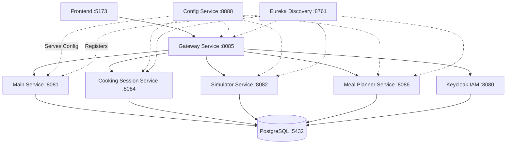

# CookMate

Mikrousługowa architektura aplikacji CookMate do zarządzania przepisami kulinarnymi.

## Architektura



## 📖 Dokumentacja Architektury (Szczegółowa)

Szczegółowe przeznaczenie, kluczowe funkcjonalności oraz detale integracyjne znajdziesz w odrębnych plikach w folderze `docs/`:

- [Main Service](docs/main-service.md)
- [Cooking Session Service](docs/cooking-session-service.md)
- [Simulator Service](docs/simulator-service.md)
- [Meal Planner Service](docs/meal-planner-service.md)
- [Infrastruktura (Gateway, Config, Discovery)](docs/infrastructure-services.md)

## Serwisy i porty

| Serwis                    | Port | Opis                                                  |
|---------------------------|------|-------------------------------------------------------|
| `config-service`          | 8888 | Spring Cloud Config Server                            |
| `discovery-service`       | 8761 | Eureka Discovery Server                               |
| `gateway-service`         | 8085 | Spring Cloud Gateway + OAuth2 Client                  |
| `main-service`            | 8081 | REST API zarządzania przepisami + PostgreSQL          |
| `cooking-session-service` | 8084 | Reaktywne zarządzanie sesją gotowania (SSE)           |
| `simulator-service`       | 8082 | Symulator planowania posiłków (Feign)                 |
| `meal-planner-service`    | 8086 | Planowanie tygodniowych posiłków i list zakupów       |
| `keycloak`                | 8080 | Keycloak Identity & Access Management                 |
| `postgres`                | 5432 | Baza danych PostgreSQL                                |

## Stos technologiczny

- **Java 25** / **Spring Boot 4.0.5**
- **Spring Cloud 2024.0.0** (Config, Eureka, OpenFeign, LoadBalancer)
- **Spring Data JPA** + **PostgreSQL**
- **Docker** (multi-stage build) + **Docker Compose**

### Dokumentacja API (Swagger)

Wszystkie kluczowe mikroserwisy posiadają teraz wygenerowaną i zunifikowaną dokumentację Swagger/OpenAPI dostępną przez przyjazny interfejs UI:

- [Main Service Swagger UI](http://localhost:8081/swagger-ui.html)
- [Simulator Service Swagger UI](http://localhost:8082/swagger-ui.html)
- [Cooking Session Service Swagger UI](http://localhost:8084/swagger-ui.html)
- [Meal Planner Service Swagger UI](http://localhost:8086/swagger-ui.html)

Dostęp do samych definicji znajduje się pod ścieżkami `/v3/api-docs`. Zabezpieczenia Spring Security zostały odpowiednio skonfigurowane tak, aby swobodnie czytać dokumentację bez konieczności logowania (wykonywanie samych akcji wewnątrz interfejsu wymaga autoryzacji tokenem JWT z Keycloak).

### Komunikacja Symulacji

Zaimplementowano mechanizm notyfikacji kroków symulacji:

- **Simulator-Service** wysyła notyfikację do **Main-Service** po każdym wykonanym kroku
- **Main-Service** zapisuje postęp w tabeli `simulation_progress` (PostgreSQL)
- **Frontend** może poolować endpointy `/api/simulation-progress/sessions/{sessionId}` w celu śledzenia postępu
- Asynchroniczna wysyłka (nie blokuje głównego wątku symulatora)
- Deduplikacja eventów - brak duplikatów w bazie danych

## Uruchomienie

### Docker Compose (zalecane)

```bash
# Zbuduj i uruchom wszystkie serwisy
docker compose up --build

# Uruchom w tle
docker compose up --build -d

# Zatrzymaj
docker compose down
```

> Dla `postgres:18+` dane są trzymane w nowym układzie katalogów.  
> Jeśli wcześniej był używany wolumen z `postgres:17` lub starszym, wykonaj migrację (`pg_upgrade`) albo zresetuj środowisko developerskie:
> `docker compose down -v && docker volume rm sumatywny_postgres-data` (lub odpowiedni wolumen dla projektu).

Kolejność startu: **PostgreSQL + Keycloak → Config → Discovery → main-service / cooking-session-service / simulator-service → gateway-service**

### Lokalne uruchomienie (każdy serwis osobno)

```bash
# 1. Uruchom PostgreSQL
docker run -e POSTGRES_DB=cookmate -e POSTGRES_USER=cookmate \
           -e POSTGRES_PASSWORD=cookmate -p 5432:5432 postgres:18-alpine

# 2. config-service
cd config-service && mvn spring-boot:run

# 3. discovery-service
cd discovery-service && mvn spring-boot:run

# 4. main-service
cd main-service && mvn spring-boot:run

# 5. simulator-service
cd simulator-service && mvn spring-boot:run
```

## Endpointy

### main-service (`http://localhost:8081`)

| Metoda | Ścieżka               | Opis                     |
|--------|-----------------------|--------------------------|
| GET    | `/api/recipes`        | Lista wszystkich przepisów|
| GET    | `/api/recipes?name=X` | Szukaj przepisu po nazwie|
| GET    | `/api/recipes/{id}`   | Pobierz przepis           |
| GET    | `/api/recipes/{id}/steps` | Pobierz zapisane w bazie kroki dla przepisu (używane do synchronizacji UI) |
| GET    | `/api/steps/{stepId}`     | Pobierz pojedynczy krok   |
| POST   | `/api/steps/generate` | Generowanie kroków przepisu (LLM) do bazy (używane przed startem symulacji)|
| POST   | `/api/recipes`        | Utwórz przepis            |
| PUT    | `/api/recipes/{id}`   | Zaktualizuj przepis       |
| DELETE | `/api/recipes/{id}`   | Usuń przepis              |
| POST   | `/api/simulation-progress` | Otrzymaj event kroku od symulatora |
| GET    | `/api/simulation-progress/sessions/{sessionId}` | Historia sesji symulacji (używane do poolowania progresu w UI) |
| GET    | `/api/simulation-progress/sessions/{sessionId}/latest` | Ostatni wykonany krok |
| GET    | `/api/simulation-progress/recipes/{recipeId}` | Historia przepisu |
| GET    | `/actuator/health`    | Health check              |

### simulator-service (`http://localhost:8082`)

| Metoda | Ścieżka                         | Opis                              |
|--------|---------------------------------|-----------------------------------|
| POST   | `/api/simulator/sessions/start` | Start sesji dla recipeId          |
| POST   | `/api/simulator/sessions/{sessionId}/steps/execute` | Wykonaj kolejny krok |
| GET    | `/api/simulator/sessions/{sessionId}/status` | Odczyt postępu sesji |
| GET    | `/api/simulator/sessions/{sessionId}/history` | Historia kroków |
| GET    | `/actuator/health`              | Health check                      |

### discovery-service (`http://localhost:8761`)

Eureka Dashboard dostępny pod: `http://localhost:8761`

### config-service (`http://localhost:8888`)

```
GET http://localhost:8888/main-service/default
GET http://localhost:8888/simulator-service/default
GET http://localhost:8888/application/default
```

### keycloak (`http://localhost:8080`)

Admin console: `http://localhost:8080/admin/master/console/`

**Default credentials:**
- Username: `admin`
- Password: `admin`

**Realm import:** Start kontenera automatycznie importuje `keycloak/realm-export.json` (Realm `cookmate`).

**OIDC client (Authorization Code flow):**
- Client ID: `cookmate-client`
- Client Secret: `cookmate-secret`
- Valid Redirect URIs: `http://localhost:5173/*`, `http://localhost:8081/*`
- Web Origins: `http://localhost:5173`, `http://localhost:8081`

**Test user (realm `cookmate`):**
- Username: `test.user`
- Password: `test12345`
- Roles: `ROLE_USER`, `ROLE_ADMIN`

**Note:** Change default credentials in production. Keycloak uses a separate PostgreSQL database (`keycloak`) for configuration, users, and sessions persistence.

## Struktura projektu

```
CookMate/
├── config-repo/                    # Pliki konfiguracyjne serwowane przez Config Server
│   ├── application.yml             # Globalna konfiguracja (wszystkie serwisy)
│   ├── main-service.yml            # Konfiguracja main-service
│   └── simulator-service.yml       # Konfiguracja simulator-service
├── config-service/                 # Spring Cloud Config Server (:8888)
│   ├── Dockerfile
│   ├── pom.xml
│   └── src/main/java/com/cookmate/config/ConfigServiceApplication.java
├── discovery-service/              # Eureka Discovery Server (:8761)
│   ├── Dockerfile
│   ├── pom.xml
│   └── src/main/java/com/cookmate/discovery/DiscoveryServiceApplication.java
├── main-service/                   # Serwis przepisów (:8081)
│   ├── Dockerfile
│   ├── pom.xml
│   └── src/main/java/com/cookmate/main/
│       ├── MainServiceApplication.java
│       ├── controller/RecipeController.java
│       ├── model/Recipe.java
│       ├── repository/RecipeRepository.java
│       └── service/RecipeService.java
├── simulator-service/              # Serwis symulatora (:8082)
│   ├── Dockerfile
│   ├── pom.xml
│   └── src/main/java/com/cookmate/simulator/
│       ├── SimulatorServiceApplication.java
│       ├── client/MainServiceClient.java
│       ├── config/SimulationConfig.java
│       ├── controller/SimulatorController.java
│       ├── dto/*.java
│       ├── exception/*.java
│       ├── model/*.java
│       └── service/SimulationService.java
├── keycloak/
│   └── realm-export.json            # Import Realm/klientów/użytkowników Keycloak
├── docker-compose.yml
└── pom.xml                         # Root Maven aggregator
```
