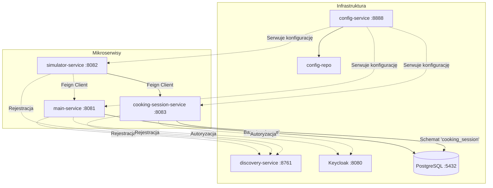
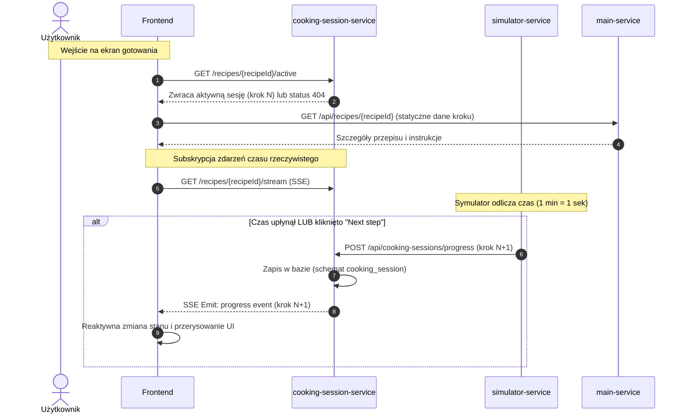

# CookMate

Mikrousługowa architektura aplikacji CookMate do zarządzania przepisami kulinarnymi.

## Architektura mikrousług

```
                             ┌─────────────────┐
                             │  config-service │  :8888
                             │@EnableConfigServ│
                             └────────┬────────┘
                                      │ reads
                             ┌────────▼────────┐
                             │   config-repo/  │  (pliki YAML)
                             └─────────────────┘
                                      │ serves config to
             ┌────────────────┬───────┴───────┬────────────────┐
             ▼                ▼               ▼                ▼
    ┌─────────────────┐ ┌───────────┐ ┌───────────────┐ ┌──────────────────┐
    │discovery-service│ │main-service│ │cooking-session│ │simulator-service │
    │@EnableEurekaServ│ │   :8081   │ │    :8083      │ │     :8082        │
    │     :8761       │ └─────┬─────┘ └───────┬───────┘ └────────┬─────────┘
    └────────┬────────┘       │               │                  │
             │ registers      │ registers     │ registers        │ registers
             └────────────────┴───────┬───────┴──────────────────┘
                                      │
                        ┌─────────────┴──────────────┐
                        ▼                            ▼
                ┌──────────────────┐        ┌─────────────────┐
                │   PostgreSQL     │        │   Keycloak      │  :8080
                │  cookmate / auth │        │  (IAM & SSO)    │
                │     :5432        │        │ (keycloak db)   │
                └──────────────────┘        └─────────────────┘
```

### Diagram Relacji (Mermaid)



## Serwisy i porty

| Serwis                    | Port | Opis                                                  |
|---------------------------|------|-------------------------------------------------------|
| `config-service`          | 8888 | Spring Cloud Config Server                            |
| `discovery-service`       | 8761 | Eureka Discovery Server                               |
| `main-service`            | 8081 | REST API zarządzania przepisami + PostgreSQL          |
| `cooking-session-service` | 8083 | Reaktywne zarządzanie sesją gotowania (SSE)           |
| `simulator-service`       | 8082 | Symulator planowania posiłków (Feign)                 |
| `keycloak`                | 8080 | Keycloak Identity & Access Management                 |
| `postgres`                | 5432 | Baza danych PostgreSQL                                |

## Stos technologiczny

- **Java 25** / **Spring Boot 4.0.5**
- **Spring Cloud 2024.0.0** (Config, Eureka, OpenFeign, LoadBalancer)
- **Spring Data JPA** + **PostgreSQL**
- **Docker** (multi-stage build) + **Docker Compose**

## Ostatnie Zmiany

### ✨ Wydzielenie Sesji Gotowania i Komunikacja Real-Time SSE (v1.2)

Przeniesiono logikę sesji gotowania do nowego mikroserwisu `cooking-session-service` zgodnie z planem:

- **Wydzielony Serwis**: Utworzono `cooking-session-service` na porcie `8083`, który przechowuje dane w schemacie `cooking_session`.
- **Komunikacja SSE**: Zastąpiono polling mechanizmem Server-Sent Events (SSE). Klient subskrybuje strumień pod `/api/cooking-sessions/recipes/{recipeId}/stream` i natychmiastowo otrzymuje powiadomienia o postępie bez odpytywania bazy w pętli.
- **Wznowienie Sesji**: Przy wejściu na widok gotowania frontend automatycznie pobiera status aktywnej sesji `/recipes/{recipeId}/active` i odtwarza stan (timer, kroki) bez zapisywania stanu w `localStorage`.
- **Integracja Symulatora**: Symulator po wykonaniu kroku wysyła powiadomienia do `cooking-session-service` pod `/api/cooking-sessions/progress`.
- **Clean-up**: Usunięto przestarzałe kontrolery i tabele `simulation_progress` z `main-service`.

---

## Uruchomienie

### Docker Compose (zalecane)

```bash
# Zbuduj i uruchom wszystkie serwisy
docker compose up --build

# Uruchom w tle
docker compose up --build -d

# Zatrzymaj
docker compose down
```

> Dla `postgres:18+` dane są trzymane w nowym układzie katalogów.  
> Jeśli wcześniej był używany wolumen z `postgres:17` lub starszym, wykonaj migrację (`pg_upgrade`) albo zresetuj środowisko developerskie:  
> `docker compose down -v && docker volume rm sumatywny_postgres-data` (lub odpowiedni wolumen dla projektu).

Kolejność startu: **PostgreSQL → Config → Discovery → main-service / cooking-session-service / simulator-service → Keycloak**

### Lokalne uruchomienie (każdy serwis osobno)

```bash
# 1. Uruchom PostgreSQL
docker run -e POSTGRES_DB=cookmate -e POSTGRES_USER=cookmate \
           -e POSTGRES_PASSWORD=cookmate -p 5432:5432 postgres:18-alpine

# 2. config-service
cd config-service && mvn spring-boot:run

# 3. discovery-service
cd discovery-service && mvn spring-boot:run

# 4. main-service
cd main-service && mvn spring-boot:run

# 5. cooking-session-service
cd cooking-session-service && mvn spring-boot:run

# 6. simulator-service
cd simulator-service && mvn spring-boot:run
```

---

## Endpointy

### main-service (`http://localhost:8081`)

| Metoda | Ścieżka               | Opis                     |
|--------|-----------------------|--------------------------|
| GET    | `/api/recipes`        | Lista wszystkich przepisów|
| GET    | `/api/recipes?name=X` | Szukaj przepisu po nazwie|
| GET    | `/api/recipes/{id}`   | Pobierz przepis           |
| GET    | `/api/recipes/{id}/steps` | Pobierz zapisane w bazie kroki dla przepisu (używane do synchronizacji UI) |
| GET    | `/api/steps/{stepId}`     | Pobierz pojedynczy krok   |
| POST   | `/api/steps/generate` | Generowanie kroków przepisu (LLM) do bazy (używane przed startem symulacji)|
| POST   | `/api/recipes`        | Utwórz przepis            |
| PUT    | `/api/recipes/{id}`   | Zaktualizuj przepis       |
| DELETE | `/api/recipes/{id}`   | Usuń przepis              |
| GET    | `/actuator/health`    | Health check              |

### cooking-session-service (`http://localhost:8083`)

| Metoda | Ścieżka                                          | Opis                                                 |
|--------|--------------------------------------------------|------------------------------------------------------|
| POST   | `/api/cooking-sessions/progress`                 | Zapis eventu kroku z simulator-service               |
| GET    | `/api/cooking-sessions/recipes/{recipeId}/history`| Historia kroków dla przepisu                         |
| GET    | `/api/cooking-sessions/recipes/{recipeId}/latest` | Ostatni wykonany krok dla przepisu                   |
| GET    | `/api/cooking-sessions/recipes/{recipeId}/active` | Aktywna sesja do wznowienia                          |
| GET    | `/api/cooking-sessions/recipes/{recipeId}/stream` | Strumień SSE (Server-Sent Events) z postępem         |
| GET    | `/actuator/health`                                | Health check                                         |

### simulator-service (`http://localhost:8082`)

| Metoda | Ścieżka                         | Opis                              |
|--------|---------------------------------|-----------------------------------|
| POST   | `/api/simulator/sessions/start` | Start sesji dla recipeId          |
| POST   | `/api/simulator/sessions/{sessionId}/steps/execute` | Wykonaj kolejny krok |
| GET    | `/api/simulator/sessions/{sessionId}/status` | Odczyt postępu sesji |
| GET    | `/api/simulator/sessions/{sessionId}/history` | Historia kroków |
| GET    | `/actuator/health`              | Health check                      |

### discovery-service (`http://localhost:8761`)

Eureka Dashboard dostępny pod: `http://localhost:8761`

### config-service (`http://localhost:8888`)

```
GET http://localhost:8888/main-service/default
GET http://localhost:8888/cooking-session-service/default
GET http://localhost:8888/simulator-service/default
GET http://localhost:8888/application/default
```

### keycloak (`http://localhost:8080`)

Admin console: `http://localhost:8080/admin/master/console/`

**Default credentials:**
- Username: `admin`
- Password: `admin`

**Realm import:** Start kontenera automatycznie importuje `keycloak/realm-export.json` (Realm `cookmate`).

**OIDC client (Authorization Code flow):**
- Client ID: `cookmate-client`
- Client Secret: `cookmate-secret`
- Valid Redirect URIs: `http://localhost:5173/*`, `http://localhost:8081/*`
- Web Origins: `http://localhost:5173`, `http://localhost:8081`

**Test user (realm `cookmate`):**
- Username: `test.user`
- Password: `test12345`
- Roles: `ROLE_USER`, `ROLE_ADMIN`

**Note:** Change default credentials in production. Keycloak uses a separate PostgreSQL database (`keycloak`) for configuration, users, and sessions persistence.

---

# 🍳 Wydzielenie i Izolacja Sesji Gotowania (`cooking-session-service`)

W celu dekompozycji architektury monolitycznej i odciążenia `main-service`, odpowiedzialność za zarządzanie aktywnymi sesjami gotowania (`CookingSession`) została całkowicie wydzielona do niezależnego mikroserwisu **`cooking-session-service`**.

## Główne Założenia i Architektura

1. **Izolacja Bazy Danych**:
   - `cooking-session-service` posiada własny, niezależny schemat bazy danych `cooking_session` w bazie danych PostgreSQL.
   - Wszystkie tabele i operacje bazodanowe dotyczące postępu gotowania zostały usunięte z `main-service` i zaimplementowane w nowym serwisie, co zapobiega współdzieleniu danych (Shared Database Anti-Pattern).
   
2. **Rejestracja i Konfiguracja**:
   - Serwis jest w pełni zintegrowany z serwerem rejestracji **Eureka Discovery Service** (`discovery-service`), rejestrując się pod nazwą `cooking-session-service`.
   - Pobiera konfigurację centralnie ze **Spring Cloud Config** (`config-service`) z pliku `cooking-session-service.yml` umieszczonego w `config-repo`.

3. **Komunikacja Real-Time przez Server-Sent Events (SSE)**:
   - Zastąpiono tradycyjny polling połączeniem reaktywnym opartym na **SSE** pod adresem `/api/cooking-sessions/recipes/{recipeId}/stream`.
   - Serwis wykorzystuje **Project Reactor** (`Flux` zasilany przez `Sinks.Many.multicast().onBackpressureBuffer()`) do natychmiastowego wypychania informacji o zmianie kroku bezpośrednio po ich odebraniu z symulatora.

4. **Integracja z Symulatorem (`simulator-service`)**:
   - Po wykonaniu kroku (automatycznym lub ręcznym), `simulator-service` komunikuje się bezpośrednio z nowym mikroserwisem za pomocą klienta OpenFeign (`CookingSessionClient`), wysyłając żądanie `POST /api/cooking-sessions/progress`.

5. **Wznawianie Sesji i Globalna Spójność (No Polling)**:
   - Podczas wejścia na ekran gotowania, frontend odpytuje endpoint `/api/cooking-sessions/recipes/{recipeId}/active` w celu przywrócenia aktualnego stanu bez konieczności zapisywania stanu w pamięci przeglądarki (`localStorage`).
   - Aplikacja pozwala na uruchomienie tylko jednej aktywnej sesji globalnie. Próba rozpoczęcia sesji dla innego dania wyświetla monit o wymuszenie resetu poprzedniej sesji.
   - Użytkownik może swobodnie nawigować za pomocą górnego menu, a powrót do ekranu gotowania automatycznie przywraca właściwy krok i timer bez resetowania postępu.

6. **Wygląd i Logika Panelu Symulatora**:
   - Symulator wyświetla tylko jeden, aktualny krok przepisu.
   - Posiada dynamiczny pasek postępu (Progress Bar) odliczający czas w dół (gdzie 1 minuta czasu przygotowania przepisu = 1 sekunda rzeczywista).
   - Zawiera przycisk "Next step", którego kliknięcie natychmiast przerywa odliczanie i wymusza przejście do kolejnego etapu.

## Przepływ informacji (Data Flow) – Ekran Gotowania



## Struktura projektu

```
CookMate/
├── config-repo/                    # Pliki konfiguracyjne serwowane przez Config Server
│   ├── application.yml             # Globalna konfiguracja (wszystkie serwisy)
│   ├── main-service.yml            # Konfiguracja main-service
│   ├── cooking-session-service.yml # Konfiguracja cooking-session-service
│   └── simulator-service.yml       # Konfiguracja simulator-service
├── config-service/                 # Spring Cloud Config Server (:8888)
│   ├── Dockerfile
│   ├── pom.xml
│   └── src/main/java/com/cookmate/config/ConfigServiceApplication.java
├── discovery-service/              # Eureka Discovery Server (:8761)
│   ├── Dockerfile
│   ├── pom.xml
│   └── src/main/java/com/cookmate/discovery/DiscoveryServiceApplication.java
├── main-service/                   # Serwis przepisów (:8081)
│   ├── Dockerfile
│   ├── pom.xml
│   └── src/main/java/com/cookmate/main/
│       ├── MainServiceApplication.java
│       ├── controller/RecipeController.java
│       ├── model/Recipe.java
│       ├── repository/RecipeRepository.java
│       └── service/RecipeService.java
├── cooking-session-service/        # Serwis sesji gotowania (:8083)
│   ├── Dockerfile
│   ├── pom.xml
│   └── src/main/java/com/cookmate/cookingsession/
│       ├── CookingSessionServiceApplication.java
│       ├── controller/CookingSessionController.java
│       ├── model/CookingSession.java
│       └── service/CookingSessionService.java
├── simulator-service/              # Serwis symulatora (:8082)
│   ├── Dockerfile
│   ├── pom.xml
│   └── src/main/java/com/cookmate/simulator/
│       ├── SimulatorServiceApplication.java
│       ├── client/MainServiceClient.java
│       ├── config/SimulationConfig.java
│       ├── controller/SimulatorController.java
│       ├── dto/*.java
│       ├── exception/*.java
│       ├── model/*.java
│       └── service/SimulationService.java
├── keycloak/
│   └── realm-export.json            # Import Realm/klientów/użytkowników Keycloak
├── docker-compose.yml
└── pom.xml                         # Root Maven aggregator
```
